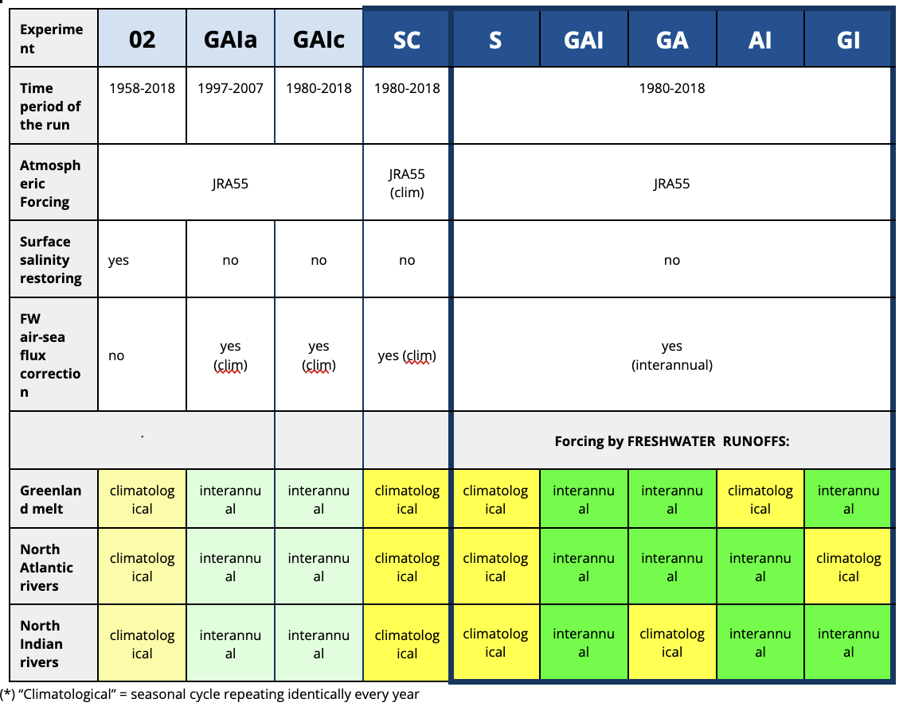
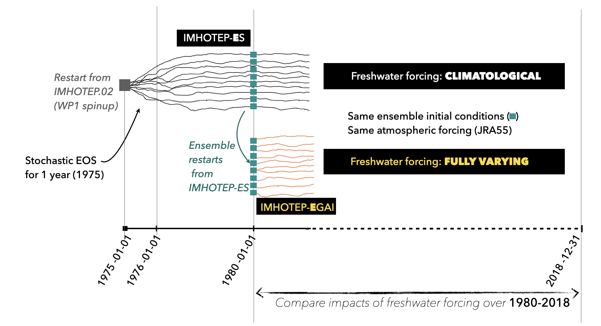

# 2. Experiments

## 2.1 Sensitivity experiments (single runs, WP1)

### Summary

_If you need to copy or modify this table, the [.doc source is available here](https://docs.google.com/document/d/1bAdjA8vK-TqqfxYqMXz69SUwyC0q7RlbeJqpd-5bzxo/edit?usp=sharing)_.

### Spinup 
Experiment IMHOTEP.02 is the spinup of the WP1 experiments. It ran from 1968 to 2018, starting from climatological initial state.  All other WP1 experiments are initialized from a restart file from IMHOTEP.02 on 1980-01-01.

### Atmospheric forcing
The IMHOTEP ocean simulations are _forced_ by the JRA55 atmoshperic reanalysis. JRA55 is the reanalysis that is being widely used for the OMIP exercise. It provides a forcing set from 1958 to present time (unlike other datasets such as DF5, the DRAKKAR forcing set, that are unavailable after 2015). As any reanalysis, JRA55 has some known biases that should be kept in mind when interpreting the IMHOTEP ocean simulations. More on JRA55 [here](https://climatedataguide.ucar.edu/climate-data/jra-55).

### Other technical details (including NEMO namelists and files) 

* __Namelists and documentation about preparing the simulations:__
An extensive technical doc and details about the NEMO configuration for each simulation (including namelists and files) have been provided by JM Molines and can be found [here](https://github.com/molines/IMHOTEP/tree/master/eORCA025).
Below we list here some additional specificities about the IMHOTEP configuration.

* __Global integral of freshwater fluxes reset to zero at each time step:__
Option ‘nn_fwb=1’ switched on in the namelist.  In order to avoid that the freshxater (FW) forcing induces increase/decrease of the global SSH in the model, the global  integral of the FW fluxes is computed at each time step and  then “reset” to zero by retrieving  an equally-distributed corrective term over the globe.
This is especially needed when using the ‘vvl’ option for SSH in the model because in that case, the model might otherwise develop  a long term trend of SSH (of several meters in long multi-year runs)  that might  in turn decrease the sea level below bathymetry in some coastal grid points (which would lead the model to crash). 
In IMHOTEP, to avoid this problem, we have followed advice from UK Met Office and Pierre Mathiot (IGE) to switch on option  ‘nn_fwb=1’. The global integral of FW fluxes is thus reset to zero at each time step (note that it does not prevent regional trends to appear).
Note however that only the _external_ FW forcing terms are taken into account in the global integral. The freshwater flux induced by the melting/freezing of sea ice (represented in the model) is not taken into account in the global integral reset. This might induced a weak seasonal cycle in the global mean SSH and even a trend if more melting than freezing occurs from year to year (which might be the case in recent years). If needed, this sea-ice induced trend in the global SSH might be removed a posteriori by removing the global integral from the SSH outputs.

---
## 2.2 Ensemble experiments (WP2))

### Summary
Three ensembles of 10 members each have been produced over 1980-2018. Their names follow the same conventions as in WP1, but start with "E" for Ensemble: EGAI, ES, EAI. 

### Spinup and initialization of the ensembles

### Atmospheric forcing
The IMHOTEP ocean simulations are _forced_ by the JRA55 atmoshperic reanalysis. JRA55 is the reanalysis that is being widely used for the OMIP exercise. It provides a forcing set from 1958 to present time (unlike other datasets such as DF5, the DRAKKAR forcing set, that are unavailable after 2015). As any reanalysis, JRA55 has some known biases that should be kept in mind when interpreting the IMHOTEP ocean simulations. More on JRA55 [here](https://climatedataguide.ucar.edu/climate-data/jra-55).

---
### Other technical details (including NEMO namelists and files) 

* __Namelists and documentation about preparing the simulations:__
An extensive technical doc and details about the NEMO configuration for each simulation (including namelists and files) have been provided by JM Molines and can be found [here](https://github.com/molines/IMHOTEP/tree/master/eORCA025).
Below we list here some additional specificities about the IMHOTEP configuration.

* __Global integral of freshwater fluxes reset to zero at each time step:__
Option ‘nn_fwb=1’ switched on in the namelist.  In order to avoid that the freshxater (FW) forcing induces increase/decrease of the global SSH in the model, the global  integral of the FW fluxes is computed at each time step and  then “reset” to zero by retrieving  an equally-distributed corrective term over the globe.
This is especially needed when using the ‘vvl’ option for SSH in the model because in that case, the model might otherwise develop  a long term trend of SSH (of several meters in long multi-year runs)  that might  in turn decrease the sea level below bathymetry in some coastal grid points (which would lead the model to crash). 
In IMHOTEP, to avoid this problem, we have followed advice from UK Met Office and Pierre Mathiot (IGE) to switch on option  ‘nn_fwb=1’. The global integral of FW fluxes is thus reset to zero at each time step (note that it does not prevent regional trends to appear).
Note however that only the _external_ FW forcing terms are taken into account in the global integral. The freshwater flux induced by the melting/freezing of sea ice (represented in the model) is not taken into account in the global integral reset. This might induced a weak seasonal cycle in the global mean SSH and even a trend if more melting than freezing occurs from year to year (which might be the case in recent years). If needed, this sea-ice induced trend in the global SSH might be removed a posteriori by removing the global integral from the SSH outputs.

