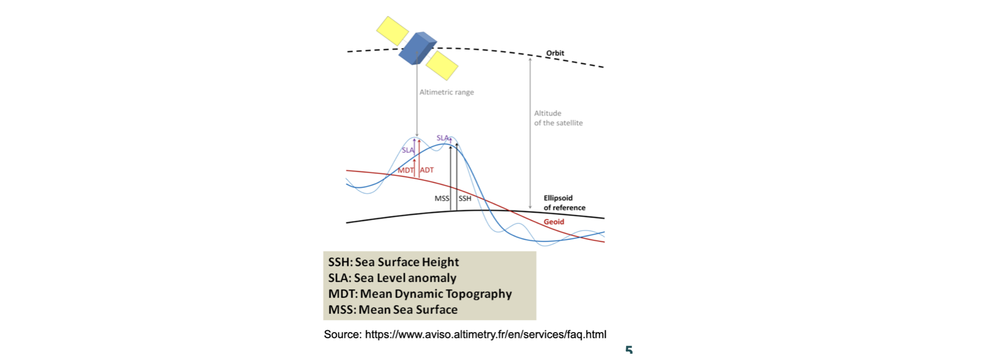

# 6. Synthetic observations

## 6.1 Synthetic along-track altimetry 1993-2018
 
---
### Summary:

* Distributed dataset version 1.1, September 2023

* Title: Synthetic along-track altimetry data over 1993-2018 from a NEMO-based simulation of the IMHOTEP project 

* Authors: Penduff T, Molines JM, Leroux S., Llovel William
* Contact: [thierry.penduff@univ-grenoble-alpes.fr]()   or [stephanie.leroux@datlas.fr]()

* Online documentation: [https://doc-imhotep.readthedocs.io/en/latest/6-Synthetic-Obs.html](https://doc-imhotep.readthedocs.io/en/latest/6-Synthetic-Obs.html)

* How to cite:
 [](https://doi.org/10.5281/zenodo.8379418)

Penduff, Thierry, Molines, Jean-Marc, Leroux, Stephanie, & Llovel, William. (2023). _Synthetic along-track altimetry data over 1993-2018 from a NEMO-based simulation of the IMHOTEP project (1.1)_ [Data set]. Zenodo. [https://zenodo.org/record/8379418](https://zenodo.org/record/8379418)


---

### What is it? Where to get the data from?

"Synthetic observations" of along-track SSH have been extracted online during the  production of the  global, NEMO-based experiment **IMHOTEP-GAIc**, at every single time and locations where a true SLA observation exists in the AVISO database for the along-track altimetry from the TOPEX, Jason-1, Jason-2 and Jason-3 satellite continuous series over the period 1993-2018. This global ocean/sea-ice/iceberg simulation uses the NEMO model, and has a horizontal resolution of 1/4°. The atmospheric forcing applied at the surface is based on the JRA reanalysis (Kobayashi et al., 2015) and varies over the full range of time-scales from 6 hours to multi-decadal. The freshwater runoff forcing applied to the experiment is fully-variable (daily to multi-decadal)  based on the ISBA hydrographic reanalysis for rivers (Decharme et al., 2019) and from altimeter data and regional GCM simulations for the liquid and solid discharges from the Greenland ice-sheet (Mouginot et al 2019). These runoffs are only climatological around Antarctica.
The synthetic along-track SSH dataset from the model is available over the altimetry period (1993-2018) on Zenodo. It is provided there along with a time-mean model SSH (gridded model field) over the same period that can be used as a proxy for mean dynamic topography ("MDT").

### Which variable does the model provide?

The model SSH from the NEMO-based IMHOTEP simulations is equivalent to the quantity called anomalous dynamic topograhy ("ADT") in the usual altimetry terms:

* In the model, the ocean at rest would be following the geoid (the
iso-gravity surface). In the model, the gravity is taken constant
(9.80665 m/s2) over the globe , which is itself considered a perfect sphere
(Radius = 6371229 m).

* In the model in practice, only the SSH gradient is used in the
computation of the horizontal surface pressure. SSH is thus known to
within a constant.

* Note also that the model is driven by a homogeneous and stationary atmospheric surface pressure (set to constant). The atmospheric surface pressure is only taken into
account by the model in the surface flux computation (bulk formulation)


_Fig.6.1 Altimetry vocabulary._

### Comments on the SSH global mean in the model

* In a Bussinesq model like NEMO, the global mean of SSH has no physical meaning: the global mean of SSH in the model can vary because of the freshwater forcing imbalance E-P-R +(SSS corrective term) - Sea ice.

* In previous simulations such as OCCIPUT, we had to remove the global mean SSH of the model at each time in the outputs before analyzing the SLA.

* In the IMHOTEP simulations we alternatively chose to control the global mean SSH on the fly in the model, by correcting the freshwater budget so that its global mean is reset to zero at every timestep.

* __However__, in the computation of this correction, only the terms E-P-R-(-SSS corrective term) are taken into account. The seasonal contribution of sea ice to the freshwater budget is not corrected (positive contribution when sea ice melts, negative when it freezes).  This means that the global mean SSH in the model is reset to almost zero every timestep but not exactly zero. The residual is due to the sea ice melting/refreezing term. One might need to remove this residual in the global mean depending on the application targeted.

### In practice, how do the synthetic along-track data look like ?

* The along-track files are in netcdf format as produced by the obs operator of the NEMO system model which is called the "feedbak" format (similar to the AVISO format).

* Below is an example of a file header. The variables that you are interested in are mainly `SLA_SSH` which is the SSH as simulated by the NEMO model in the IMHOTEP simulations. You might also want to look at `SLA_OBS` which is the true observed SLA from AVISO along the same track at the same time. The model has interpolated its simulated SSH fields to get a model SSH value at every single observation of SLA given in the AVISO files.

* You'll find an [example notebook to illustrate in practice how to open and plot those files here](https://github.com/imhotep-project/imhotep-synthetic-obs/blob/main/tools/2023-07-19_check_SLA.ipynb).

```
----------------------------------------------------------------------------------------
regi915@jean-zay3:OBS>>ncdump -h eORCA025.L75-IMHOTEP.GAIc_y2018m06d30_slafb_fdbk.496.nc
netcdf eORCA025.L75-IMHOTEP.GAIc_y2018m06d30_slafb_fdbk.496 {
dimensions:
    N_OBS = 1429621 ;
    N_LEVELS = 1 ;
    N_VARS = 1 ;
    N_QCF = 2 ;
    N_ENTRIES = 2 ;
    N_EXTRA = 1 ;
    STRINGNAM = 8 ;
    STRINGGRID = 1 ;
    STRINGWMO = 8 ;
    STRINGTYP = 4 ;
    STRINGJULD = 14 ;
variables:
    char VARIABLES(N_VARS, STRINGNAM) ;
    	VARIABLES:long_name = "List of variables in feedback files" ;
    char ENTRIES(N_ENTRIES, STRINGNAM) ;
    	ENTRIES:long_name = "List of additional entries for each variable in feedback files" ;
    char EXTRA(N_EXTRA, STRINGNAM) ;
    	EXTRA:long_name = "List of extra variables" ;
    char STATION_IDENTIFIER(N_OBS, STRINGWMO) ;
    	STATION_IDENTIFIER:long_name = "Station identifier" ;
    char STATION_TYPE(N_OBS, STRINGTYP) ;
    	STATION_TYPE:long_name = "Code instrument type" ;
    double LONGITUDE(N_OBS) ;
    	LONGITUDE:long_name = "Longitude" ;
    	LONGITUDE:units = "degrees_east" ;
    	LONGITUDE:_Fillvalue = 99999.f ;
    double LATITUDE(N_OBS) ;
    	LATITUDE:long_name = "Latitude" ;
    	LATITUDE:units = "degrees_north" ;
    	LATITUDE:_Fillvalue = 99999.f ;
    double DEPTH(N_OBS, N_LEVELS) ;
    	DEPTH:long_name = "Depth" ;
    	DEPTH:units = "metre" ;
    	DEPTH:_Fillvalue = 99999.f ;
    int DEPTH_QC(N_OBS, N_LEVELS) ;
    	DEPTH_QC:long_name = "Quality on depth" ;
    	DEPTH_QC:Conventions = "q where q =[0,9]" ;
    	DEPTH_QC:_Fillvalue = 0 ;
    int DEPTH_QC_FLAGS(N_OBS, N_LEVELS, N_QCF) ;
    	DEPTH_QC_FLAGS:long_name = "Quality flags on depth" ;
    	DEPTH_QC_FLAGS:Conventions = "NEMOVAR flag conventions" ;
    double JULD(N_OBS) ;
    	JULD:long_name = "Julian day" ;
    	JULD:units = "days since JULD_REFERENCE" ;
    	JULD:Conventions = "relative julian days with decimal part (as parts of day)" ;
    	JULD:_Fillvalue = 99999.f ;
    char JULD_REFERENCE(STRINGJULD) ;
    	JULD_REFERENCE:long_name = "Date of reference for julian days" ;
    	JULD_REFERENCE:Conventions = "YYYYMMDDHHMMSS" ;
    int OBSERVATION_QC(N_OBS) ;
    	OBSERVATION_QC:long_name = "Quality on observation" ;
    	OBSERVATION_QC:Conventions = "q where q =[0,9]" ;
    	OBSERVATION_QC:_Fillvalue = 0 ;
    int OBSERVATION_QC_FLAGS(N_OBS, N_QCF) ;
    	OBSERVATION_QC_FLAGS:long_name = "Quality flags on observation" ;
    	OBSERVATION_QC_FLAGS:Conventions = "NEMOVAR flag conventions" ;
    	OBSERVATION_QC_FLAGS:_Fillvalue = 0 ;
    int POSITION_QC(N_OBS) ;
    	POSITION_QC:long_name = "Quality on position (latitude and longitude)" ;
    	POSITION_QC:Conventions = "q where q =[0,9]" ;
    	POSITION_QC:_Fillvalue = 0 ;
    int POSITION_QC_FLAGS(N_OBS, N_QCF) ;
    	POSITION_QC_FLAGS:long_name = "Quality flags on position" ;
    	POSITION_QC_FLAGS:Conventions = "NEMOVAR flag conventions" ;
    	POSITION_QC_FLAGS:_Fillvalue = 0 ;
    int JULD_QC(N_OBS) ;
    	JULD_QC:long_name = "Quality on date and time" ;
    	JULD_QC:Conventions = "q where q =[0,9]" ;
    	JULD_QC:_Fillvalue = 0 ;
    int JULD_QC_FLAGS(N_OBS, N_QCF) ;
    	JULD_QC_FLAGS:long_name = "Quality flags on date and time" ;
    	JULD_QC_FLAGS:Conventions = "NEMOVAR flag conventions" ;
    	JULD_QC_FLAGS:_Fillvalue = 0 ;
    int ORIGINAL_FILE_INDEX(N_OBS) ;
    	ORIGINAL_FILE_INDEX:long_name = "Index in original data file" ;
    	ORIGINAL_FILE_INDEX:_Fillvalue = -99999 ;
    float SLA_OBS(N_OBS, N_LEVELS) ;
    	SLA_OBS:long_name = "Sea level anomaly" ;
    	SLA_OBS:units = "Metres" ;
    	SLA_OBS:_Fillvalue = 99999.f ;
    float SLA_Hx(N_OBS, N_LEVELS) ;
    	SLA_Hx:long_name = "Model interpolated SSH - MDT" ;
    	SLA_Hx:units = "Metres" ;
    	SLA_Hx:_Fillvalue = 99999.f ;
    float SLA_SSH(N_OBS, N_LEVELS) ;
    	SLA_SSH:long_name = "Model Sea surface height" ;
    	SLA_SSH:units = "Metres" ;
    	SLA_SSH:_Fillvalue = 99999.f ;
    int SLA_QC(N_OBS) ;
    	SLA_QC:long_name = "Quality on sea level anomaly" ;
    	SLA_QC:Conventions = "q where q =[0,9]" ;
    	SLA_QC:_Fillvalue = 0 ;
    int SLA_QC_FLAGS(N_OBS, N_QCF) ;
    	SLA_QC_FLAGS:long_name = "Quality flags on sea level anomaly" ;
    	SLA_QC_FLAGS:Conventions = "NEMOVAR flag conventions" ;
    	SLA_QC_FLAGS:_Fillvalue = 0 ;
    int SLA_LEVEL_QC(N_OBS, N_LEVELS) ;
    	SLA_LEVEL_QC:long_name = "Quality for each level on sea level anomaly" ;
    	SLA_LEVEL_QC:Conventions = "q where q =[0,9]" ;
    	SLA_LEVEL_QC:_Fillvalue = 0 ;
    int SLA_LEVEL_QC_FLAGS(N_OBS, N_LEVELS, N_QCF) ;
    	SLA_LEVEL_QC_FLAGS:long_name = "Quality flags for each level on sea level anomaly" ;
    	SLA_LEVEL_QC_FLAGS:Conventions = "NEMOVAR flag conventions" ;
    	SLA_LEVEL_QC_FLAGS:_Fillvalue = 0 ;
    int SLA_IOBSI(N_OBS) ;
    	SLA_IOBSI:long_name = "ORCA grid search I coordinate" ;
    int SLA_IOBSJ(N_OBS) ;
    	SLA_IOBSJ:long_name = "ORCA grid search J coordinate" ;
    int SLA_IOBSK(N_OBS, N_LEVELS) ;
    	SLA_IOBSK:long_name = "ORCA grid search K coordinate" ;
    char SLA_GRID(STRINGGRID) ;
    	SLA_GRID:long_name = "ORCA grid search grid (T,U,V)" ;
    float MDT(N_OBS, N_LEVELS) ;
    	MDT:long_name = "Mean dynamic topography" ;
    	MDT:units = "Metres" ;
    	MDT:_Fillvalue = 99999.f ;

// global attributes:
    	:title = "NEMO observation operator output" ;
    	:Convention = "NEMO unified observation operator output" ;
```
### References:

* 2019 Decharme, B., Delire, C., Minvielle, M., Colin, J., Vergnes, J.-P., Alias, A., et al. (2019). Recent changes in the ISBA-CTRIP land surface system for use in the CNRM-CM6 climate model and in global off-line hydrological applications. Journal of Advances in Modeling Earth Systems, 11, 1207– 1252. [https://doi.org/10.1029/2018MS001545](https://doi.org/10.1029/2018MS001545).

* 2019 Mouginot J., Rignot E., Bjørk A., van den Broeke M. , Millan R., Morlighem M. , Noël B., Scheuchl B., and Wood M, Forty-six years of Greenland Ice Sheet mass balance from 1972 to 2018, Proceedings of the National Academy of Sciences May 2019, 116 (19) 9239-9244; DOI: [https://doi.org/10.1073/pnas.1904242116](https://doi.org/10.1073/pnas.1904242116 ).

* 2015 KOBAYASHI S., OTA Y, HARADA Y, EBITA A., MORIYA M, ONODA H, ONOGI H, KAMAHORI H, KOBAYASHI C, ENDO H, MIYAOKA K, TAKAHASHI K (2015): The JRA-55 Reanalysis: General Specifications and Basic Characteristics, Journal of the Meteorological Society of Japan. Ser. II, 2015, Volume 93, Issue 1, Pages 5-48. [https://doi.org/10.2151/jmsj.2015-001](https://doi.org/10.2151/jmsj.2015-001).


---
## 6.2 Synthetic in-situ Temperature and Salinity profiles over 1980-2018


### Summary:

* Distributed dataset version 1.0, September 2023

* Title: Synthetic in-situ T/S data over 1993-2018 from a NEMO-based simulation of the IMHOTEP project 

* Authors: Penduff T, Molines JM, Leroux S., Llovel William
* Contact: thierry.penduff@univ-grenoble-alpes.fr   or stephanie.leroux@datlas.fr

* Online documentation: https://doc-imhotep.readthedocs.io/en/latest/6-Synthetic-Obs.html
* How to cite: [](https://doi.org/10.5281/zenodo.10033077)

Penduff, Thierry, Molines, Jean-Marc, Leroux, Stephanie, & Llovel, William. (2023). _Synthetic in-situ T/S data over 1993-2018 from a NEMO-based simulation of the IMHOTEP project (1.1)_ [Data set]. Zenodo. [https://doi.org/](https://doi.org/)

---

### What is it? Where to get the data from?

"Synthetic observations" of in-situ Temperature and Salinity profiles as a function ofwith depth have been extracted online during the  production of the global, NEMO-based experiment ** IMHOTEP-GAIc**, at every single time and locations (in x,y,z dimensions) where a true in-situ profile exists in the ENACT-4  database (Good et al 2013) over the simulation period: 1980-2018. This global ocean/sea-ice/iceberg simulation uses the NEMO model, and has a horizontal resolution of 1/4°. The atmospheric forcing applied at the surface is based on the JRA reanalysis (Kobayashi et al., 2015) and varies over the full range of time-scales from 6 hours to multi-decadal. The freshwater runoff forcing applied to the experiment is fully-variable (daily to multi-decadal)  based on the ISBA-CTRIP hydrographic reanalysis for rivers (Decharme et al., 2019) and from altimeter data and regional GCM simulations for the liquid and solid discharges from the Greenland ice-sheet (Mouginot et al 2019). These runoffs are only climatological around Antarctica.
The synthetic  in-situ T/S dataset from the model is available over the period 1993-2018 on Zenodo. 


### In practice, how do the synthetic in-situ T/S data look like ?

* The  files are in netcdf format as produced by the obs operator of the NEMO system model which is called the "feedback" format (similar to the EN4 format), and includes both the sythetic values extracted from the model simulation (variables with suffix `_Hx` at the end of its name), and the values of the true observation in the EN4 database (variables with suffix `_OBS` at the end of its name).

* An example of a file header is shown below the references section.

### References
* 2019 Decharme, B., Delire, C., Minvielle, M., Colin, J., Vergnes, J.-P., Alias, A., et al. (2019). Recent changes in the ISBA-CTRIP land surface system for use in the CNRM-CM6 climate model and in global off-line hydrological applications. Journal of Advances in Modeling Earth Systems, 11, 1207– 1252. https://doi.org/10.1029/2018MS001545.
* 2019 Mouginot J., Rignot E., Bjørk A., van den Broeke M. , Millan R., Morlighem M. , Noël B., Scheuchl B., and Wood M, Forty-six years of Greenland Ice Sheet mass balance from 1972 to 2018, Proceedings of the National Academy of Sciences May 2019, 116 (19) 9239-9244; DOI: https://doi.org/10.1073/pnas.1904242116.
* 2015 KOBAYASHI S., OTA Y, HARADA Y, EBITA A., MORIYA M, ONODA H, ONOGI H, KAMAHORI H, KOBAYASHI C, ENDO H, MIYAOKA K, TAKAHASHI K (2015): The JRA-55 Reanalysis: General Specifications and Basic Characteristics, Journal of the Meteorological Society of Japan. Ser. II, 2015, Volume 93, Issue 1, Pages 5-48. https://doi.org/10.2151/jmsj.2015-001.
* 2013, Good, Martin, Reyner, EN4: Quality controlled ocean temperature and salinity profiles and monthly objective analyses with uncertainty estimates,  Journal of Geophysical Research: Oceans 118(12), DOI:10.1002/2013JC009067


```
----------------------------------------------------------------------------------------
ncdump -h eORCA025.L75-IMHOTEP.GAIc_y2018m12d31_enact4_fdbk.502.nc
netcdf eORCA025.L75-IMHOTEP.GAIc_y2018m12d31_enact4_fdbk.502 {
dimensions:
    N_OBS = 22033 ;
    N_LEVELS = 400 ;
    N_VARS = 2 ;
    N_QCF = 2 ;
    N_ENTRIES = 1 ;
    N_EXTRA = 1 ;
    STRINGNAM = 8 ;
    STRINGGRID = 1 ;
    STRINGWMO = 8 ;
    STRINGTYP = 4 ;
    STRINGJULD = 14 ;
variables:
    char VARIABLES(N_VARS, STRINGNAM) ;
   	 VARIABLES:long_name = "List of variables in feedback files" ;
    char ENTRIES(N_ENTRIES, STRINGNAM) ;
   	 ENTRIES:long_name = "List of additional entries for each variable in feedback files" ;
    char EXTRA(N_EXTRA, STRINGNAM) ;
   	 EXTRA:long_name = "List of extra variables" ;
    char STATION_IDENTIFIER(N_OBS, STRINGWMO) ;
   	 STATION_IDENTIFIER:long_name = "Station identifier" ;
    char STATION_TYPE(N_OBS, STRINGTYP) ;
   	 STATION_TYPE:long_name = "Code instrument type" ;
    double LONGITUDE(N_OBS) ;
   	 LONGITUDE:long_name = "Longitude" ;
   	 LONGITUDE:units = "degrees_east" ;
   	 LONGITUDE:_Fillvalue = 99999.f ;
    double LATITUDE(N_OBS) ;
   	 LATITUDE:long_name = "Latitude" ;
   	 LATITUDE:units = "degrees_north" ;
   	 LATITUDE:_Fillvalue = 99999.f ;
    double DEPTH(N_OBS, N_LEVELS) ;
   	 DEPTH:long_name = "Depth" ;
   	 DEPTH:units = "metre" ;
   	 DEPTH:_Fillvalue = 99999.f ;
    int DEPTH_QC(N_OBS, N_LEVELS) ;
   	 DEPTH_QC:long_name = "Quality on depth" ;
   	 DEPTH_QC:Conventions = "q where q =[0,9]" ;
   	 DEPTH_QC:_Fillvalue = 0 ;
    int DEPTH_QC_FLAGS(N_OBS, N_LEVELS, N_QCF) ;
   	 DEPTH_QC_FLAGS:long_name = "Quality flags on depth" ;
   	 DEPTH_QC_FLAGS:Conventions = "NEMOVAR flag conventions" ;
    double JULD(N_OBS) ;
   	 JULD:long_name = "Julian day" ;
   	 JULD:units = "days since JULD_REFERENCE" ;
   	 JULD:Conventions = "relative julian days with decimal part (as parts of day)" ;
   	 JULD:_Fillvalue = 99999.f ;
    char JULD_REFERENCE(STRINGJULD) ;
   	 JULD_REFERENCE:long_name = "Date of reference for julian days" ;
   	 JULD_REFERENCE:Conventions = "YYYYMMDDHHMMSS" ;
    int OBSERVATION_QC(N_OBS) ;
   	 OBSERVATION_QC:long_name = "Quality on observation" ;
   	 OBSERVATION_QC:Conventions = "q where q =[0,9]" ;
   	 OBSERVATION_QC:_Fillvalue = 0 ;
    int OBSERVATION_QC_FLAGS(N_OBS, N_QCF) ;
   	 OBSERVATION_QC_FLAGS:long_name = "Quality flags on observation" ;
   	 OBSERVATION_QC_FLAGS:Conventions = "NEMOVAR flag conventions" ;
   	 OBSERVATION_QC_FLAGS:_Fillvalue = 0 ;
    int POSITION_QC(N_OBS) ;
   	 POSITION_QC:long_name = "Quality on position (latitude and longitude)" ;
   	 POSITION_QC:Conventions = "q where q =[0,9]" ;
   	 POSITION_QC:_Fillvalue = 0 ;
    int POSITION_QC_FLAGS(N_OBS, N_QCF) ;
   	 POSITION_QC_FLAGS:long_name = "Quality flags on position" ;
   	 POSITION_QC_FLAGS:Conventions = "NEMOVAR flag conventions" ;
   	 POSITION_QC_FLAGS:_Fillvalue = 0 ;
    int JULD_QC(N_OBS) ;
   	 JULD_QC:long_name = "Quality on date and time" ;
   	 JULD_QC:Conventions = "q where q =[0,9]" ;
   	 JULD_QC:_Fillvalue = 0 ;
    int JULD_QC_FLAGS(N_OBS, N_QCF) ;
   	 JULD_QC_FLAGS:long_name = "Quality flags on date and time" ;
   	 JULD_QC_FLAGS:Conventions = "NEMOVAR flag conventions" ;
   	 JULD_QC_FLAGS:_Fillvalue = 0 ;
    int ORIGINAL_FILE_INDEX(N_OBS) ;
   	 ORIGINAL_FILE_INDEX:long_name = "Index in original data file" ;
   	 ORIGINAL_FILE_INDEX:_Fillvalue = -99999 ;
    float POTM_OBS(N_OBS, N_LEVELS) ;
   	 POTM_OBS:long_name = "Potential temperature" ;
   	 POTM_OBS:units = "Degrees centigrade" ;
   	 POTM_OBS:_Fillvalue = 99999.f ;
    float POTM_Hx(N_OBS, N_LEVELS) ;
   	 POTM_Hx:long_name = "Model interpolated potential temperature" ;
   	 POTM_Hx:units = "Degrees centigrade" ;
   	 POTM_Hx:_Fillvalue = 99999.f ;
    int POTM_QC(N_OBS) ;
   	 POTM_QC:long_name = "Quality on potential temperature" ;
   	 POTM_QC:Conventions = "q where q =[0,9]" ;
   	 POTM_QC:_Fillvalue = 0 ;
    int POTM_QC_FLAGS(N_OBS, N_QCF) ;
   	 POTM_QC_FLAGS:long_name = "Quality flags on potential temperature" ;
   	 POTM_QC_FLAGS:Conventions = "NEMOVAR flag conventions" ;
   	 POTM_QC_FLAGS:_Fillvalue = 0 ;
    int POTM_LEVEL_QC(N_OBS, N_LEVELS) ;
   	 POTM_LEVEL_QC:long_name = "Quality for each level on potential temperature" ;
   	 POTM_LEVEL_QC:Conventions = "q where q =[0,9]" ;
   	 POTM_LEVEL_QC:_Fillvalue = 0 ;
    int POTM_LEVEL_QC_FLAGS(N_OBS, N_LEVELS, N_QCF) ;
   	 POTM_LEVEL_QC_FLAGS:long_name = "Quality flags for each level on potential temperature" ;
   	 POTM_LEVEL_QC_FLAGS:Conventions = "NEMOVAR flag conventions" ;
   	 POTM_LEVEL_QC_FLAGS:_Fillvalue = 0 ;
    int POTM_IOBSI(N_OBS) ;
   	 POTM_IOBSI:long_name = "ORCA grid search I coordinate" ;
    int POTM_IOBSJ(N_OBS) ;
   	 POTM_IOBSJ:long_name = "ORCA grid search J coordinate" ;
    int POTM_IOBSK(N_OBS, N_LEVELS) ;
   	 POTM_IOBSK:long_name = "ORCA grid search K coordinate" ;
    char POTM_GRID(STRINGGRID) ;
   	 POTM_GRID:long_name = "ORCA grid search grid (T,U,V)" ;
    float PSAL_OBS(N_OBS, N_LEVELS) ;
   	 PSAL_OBS:long_name = "Practical salinity" ;
   	 PSAL_OBS:units = "PSU" ;
   	 PSAL_OBS:_Fillvalue = 99999.f ;
    float PSAL_Hx(N_OBS, N_LEVELS) ;
   	 PSAL_Hx:long_name = "Model interpolated practical salinity" ;
   	 PSAL_Hx:units = "PSU" ;
   	 PSAL_Hx:_Fillvalue = 99999.f ;
    int PSAL_QC(N_OBS) ;
   	 PSAL_QC:long_name = "Quality on practical salinity" ;
   	 PSAL_QC:Conventions = "q where q =[0,9]" ;
   	 PSAL_QC:_Fillvalue = 0 ;
    int PSAL_QC_FLAGS(N_OBS, N_QCF) ;
   	 PSAL_QC_FLAGS:long_name = "Quality flags on practical salinity" ;
   	 PSAL_QC_FLAGS:Conventions = "NEMOVAR flag conventions" ;
   	 PSAL_QC_FLAGS:_Fillvalue = 0 ;
    int PSAL_LEVEL_QC(N_OBS, N_LEVELS) ;
   	 PSAL_LEVEL_QC:long_name = "Quality for each level on practical salinity" ;
   	 PSAL_LEVEL_QC:Conventions = "q where q =[0,9]" ;
   	 PSAL_LEVEL_QC:_Fillvalue = 0 ;
    int PSAL_LEVEL_QC_FLAGS(N_OBS, N_LEVELS, N_QCF) ;
   	 PSAL_LEVEL_QC_FLAGS:long_name = "Quality flags for each level on practical salinity" ;
   	 PSAL_LEVEL_QC_FLAGS:Conventions = "NEMOVAR flag conventions" ;
   	 PSAL_LEVEL_QC_FLAGS:_Fillvalue = 0 ;
    int PSAL_IOBSI(N_OBS) ;
   	 PSAL_IOBSI:long_name = "ORCA grid search I coordinate" ;
    int PSAL_IOBSJ(N_OBS) ;
   	 PSAL_IOBSJ:long_name = "ORCA grid search J coordinate" ;
    int PSAL_IOBSK(N_OBS, N_LEVELS) ;
   	 PSAL_IOBSK:long_name = "ORCA grid search K coordinate" ;
    char PSAL_GRID(STRINGGRID) ;
   	 PSAL_GRID:long_name = "ORCA grid search grid (T,U,V)" ;
    float TEMP(N_OBS, N_LEVELS) ;
   	 TEMP:long_name = "Insitu temperature" ;
   	 TEMP:units = "Degrees centigrade" ;
   	 TEMP:_Fillvalue = 99999.f ;

// global attributes:
   	 :title = "NEMO observation operator output" ;
   	 :Convention = "NEMO unified observation operator output" ;
}
```


