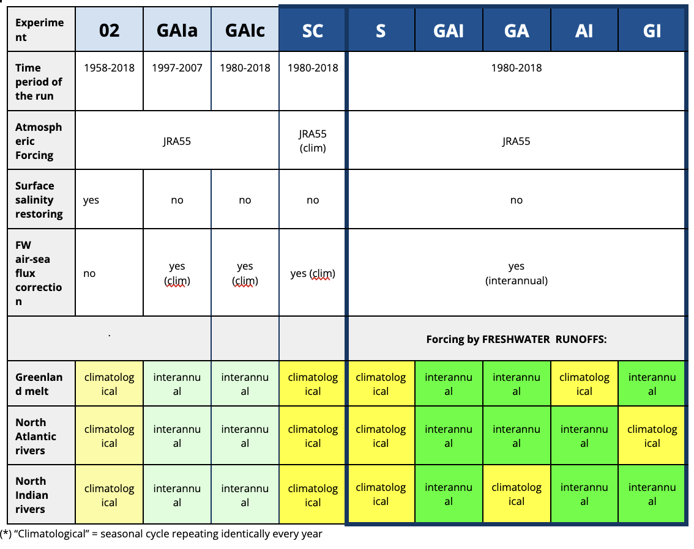
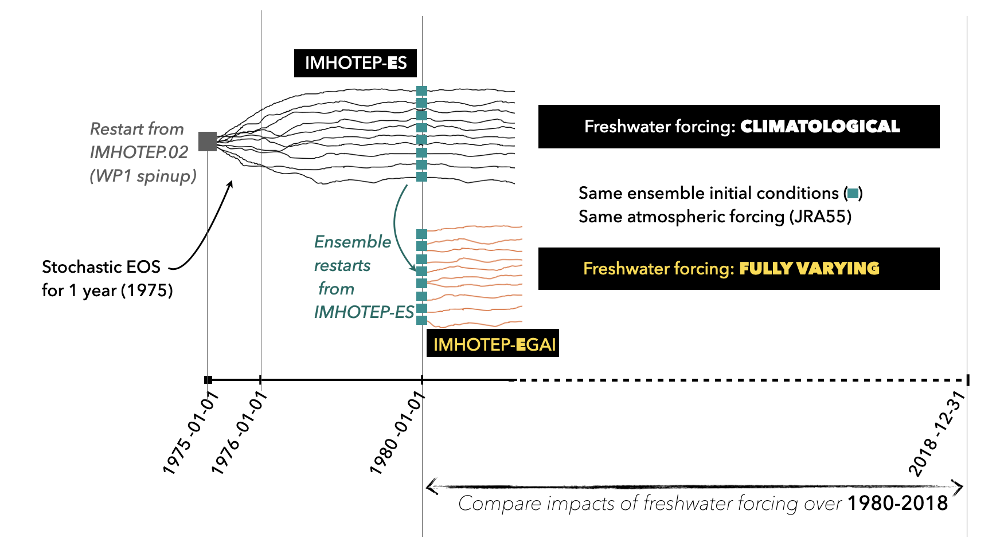

# Experiments

---
## 1. How to get access to the IMHOTEP data?
* The project is on-going and the IMHOTEP simulations are prepared and produced on Jean-Zay@IDRIS (french national HPC). The outputs are stored on Jean-Zay and reprensent ~200 To for WP1 (the global sensitivity runs).
* To get access to the data, contact first Thierry Penduff (IGE), William Llovel (LOPS), Jean-Marc Molines (IGE), Stephanie Leroux (Datlas).

---
## 2. WorkPackage 1 experiments:

### Summary:

_If you need to copy or modify this table, the [.doc source is available here](https://docs.google.com/document/d/1bAdjA8vK-TqqfxYqMXz69SUwyC0q7RlbeJqpd-5bzxo/edit?usp=sharing)_.

### Catalog of model output during WP1:
* A very raw catalog of data output produced during WP1 is available [here](https://github.com/imhotep-project/imhotep-project-on-github/tree/main/DOCS/output_catalog.md).

### Spinup 
Experiment IMHOTEP.02 is the spinup of the WP1 experiments. It ran from 1968 to 2018, starting from climatological initial state.  All other WP1 experiments are initialized from a restart file from IMHOTEP.02 on 1980-01-01.

### Technical details about the making of the NEMO configuration and experiments
* The technical doc and details on each simulations can be found [here](https://github.com/molines/IMHOTEP/tree/master/eORCA025),

---
## 3. WorkPackage 2 experiments:

### Summary
3 ensembles of 10 members each have been produced over 1980-2018. Their names follow the same conventions as in WP1, but start with the "E" of Ensemble:
- EGAI,
- ES,
- EAI. 

### Spinup and initialization of the ensembles

---
## Technical details about the making of the NEMO configuration and experiments
Jean-Marc's github here: [https://github.com/molines/IMHOTEP](https://github.com/molines/IMHOTEP).
