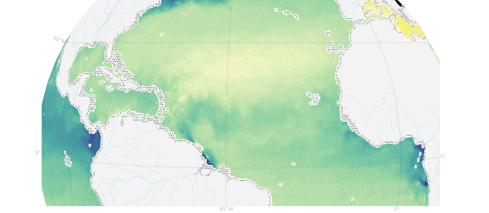

.. Imhotep documentation master file
   You can adapt this file completely to your liking, but it should at least
   contain the root `toctree` directive.

Documentation for the IMHOTEP project
==============================================

.. toctree::
   :maxdepth: 2
   :caption: Contents:

   Context
   Experiments
   Model-outputs
   Tools   